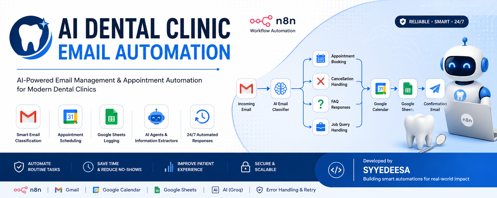
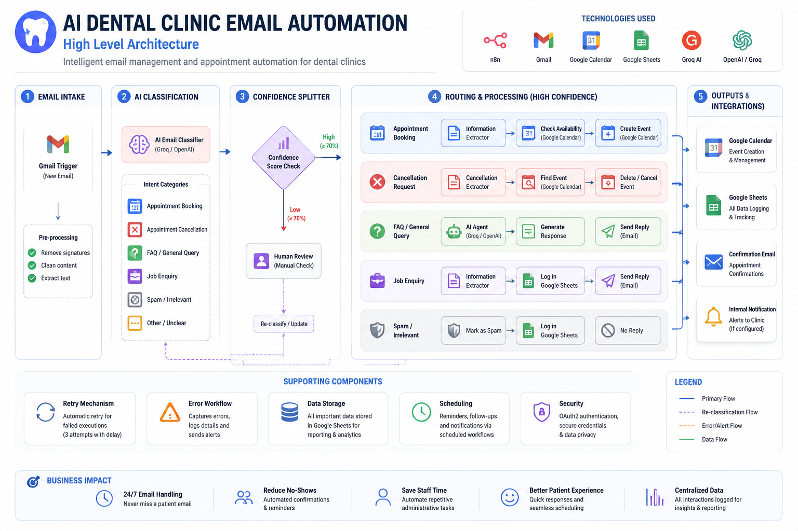
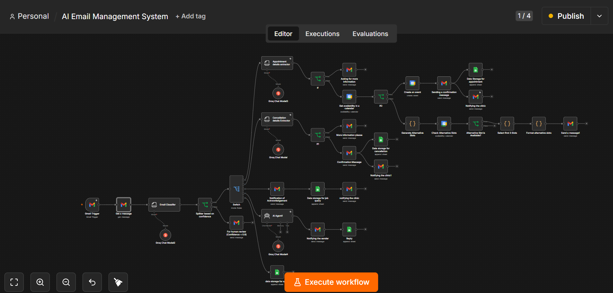
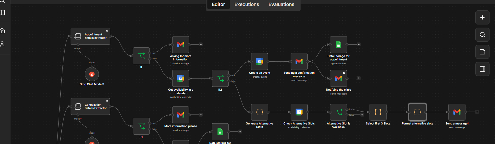

<p align="center">
  
</p>
<p align="center">


</p>


# AI Dental Clinic Email Automation

A production-ready n8n workflow that acts as a 24/7 AI-powered email receptionist for dental clinics.

## Current Capabilities

- Gmail-based email intake
- AI email classification
- Confidence-based routing and human review
- Appointment information extraction
- Missing-information handling
- Google Calendar availability checks
- Automatic appointment event creation
- Alternative appointment slot generation
- Appointment confirmation emails
- Cancellation information extraction
- Cancellation confirmation and clinic notification
- Job enquiry acknowledgement and logging
- FAQ / general enquiry handling using an AI Agent
- Spam logging
- Google Sheets data storage
- Dedicated error workflow
- Retry-on-failure settings for AI nodes

- ## 🏗️ System Architecture

This diagram provides a high-level overview of how the AI Dental Clinic Email Automation workflow processes incoming emails and routes them through specialized automation branches.



## Main Workflow

```text
Gmail Trigger
  -> Email Classifier
  -> Confidence Splitter
       -> Low confidence: Human review notification
       -> High confidence: Switch
            -> Appointment
            -> Cancellation
            -> Job enquiry
            -> General enquiry / FAQ
            -> Spam
```
# 📸 Workflow Gallery

Explore the key stages of the AI Dental Clinic Email Automation workflow.

---

## 1. Complete Workflow

The complete end-to-end n8n automation, beginning with Gmail email intake and ending with automated responses, Google Calendar scheduling, and Google Sheets logging.



---

## 2. Appointment Scheduling

The appointment scheduling branch extracts patient information, verifies calendar availability, creates appointments, and sends confirmation emails.



---

## 3. Google Calendar Integration

The workflow checks appointment availability before scheduling and prevents booking conflicts.


---

## 4. Alternative Appointment Slots

If the requested appointment time is unavailable, the workflow automatically suggests alternative available slots.


---

## 5. Human Review Routing

Emails with low AI confidence are routed for manual review instead of being processed automatically.


---

## 6. Error Workflow

Dedicated error-handling workflow for monitoring failures and improving automation reliability.


## Appointment Branch

```text
Appointment Details Extractor
  -> Missing Details Check
       -> Missing: Ask sender for more information
       -> Complete: Check Google Calendar
            -> Available: Create event
                 -> Send confirmation
                 -> Store appointment
                 -> Notify clinic
            -> Unavailable: Generate alternative slots
                 -> Check alternatives
                 -> Select best three
                 -> Format alternatives
                 -> Send alternatives to sender
```

## Cancellation Branch

```text
Cancellation Details Extractor
  -> Missing Details Check
       -> Missing: Request more information
       -> Complete:
            -> Send cancellation confirmation
            -> Store cancellation
            -> Notify clinic
```

## Job Enquiry Branch

```text
Send acknowledgement
  -> Store job enquiry
  -> Notify clinic
```

## General Enquiry Branch

```text
FAQ AI Agent
  -> Send reply
  -> Log interaction
```

## Spam Branch

```text
Store spam record
```

## Reliability Features

- AI confidence threshold before automatic action
- Human review route for uncertain classifications
- Required-field validation
- Calendar conflict detection
- Alternative-slot recovery path
- Retry-on-fail settings
- Centralized error logging workflow

## Technology Stack

- n8n
- Gmail API
- Google Calendar API
- Google Sheets API
- Groq-compatible chat models
- n8n Information Extractor
- n8n AI Agent

## Repository Structure

```text
documentation/
prompts/
extractor-specifications/
calendar-logic/
workflow-logic/
client-resources/
demo-emails/
screenshots/
assets/
deliverables/
workflows/
```

The exported n8n workflow JSON files should be placed in `workflows/`.

## Deployment Summary

1. Import the main workflow and error workflow.
2. Connect Gmail, Google Calendar, Google Sheets, and AI credentials.
3. Replace clinic-specific information.
4. Configure spreadsheet and calendar selections.
5. Test all branches.
6. Publish and activate both workflows.

## Security

Never upload API keys, OAuth client secrets, access tokens, passwords, patient data, or private clinic information to a public repository.

## Author

**Syyed Eesa**  
AI Automation Developer
